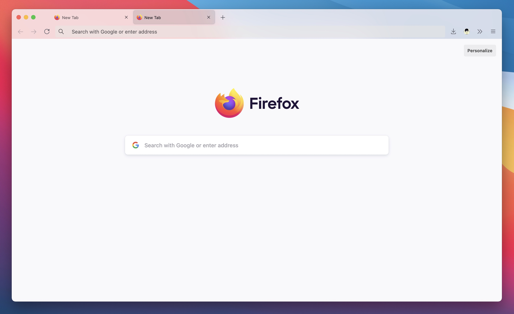
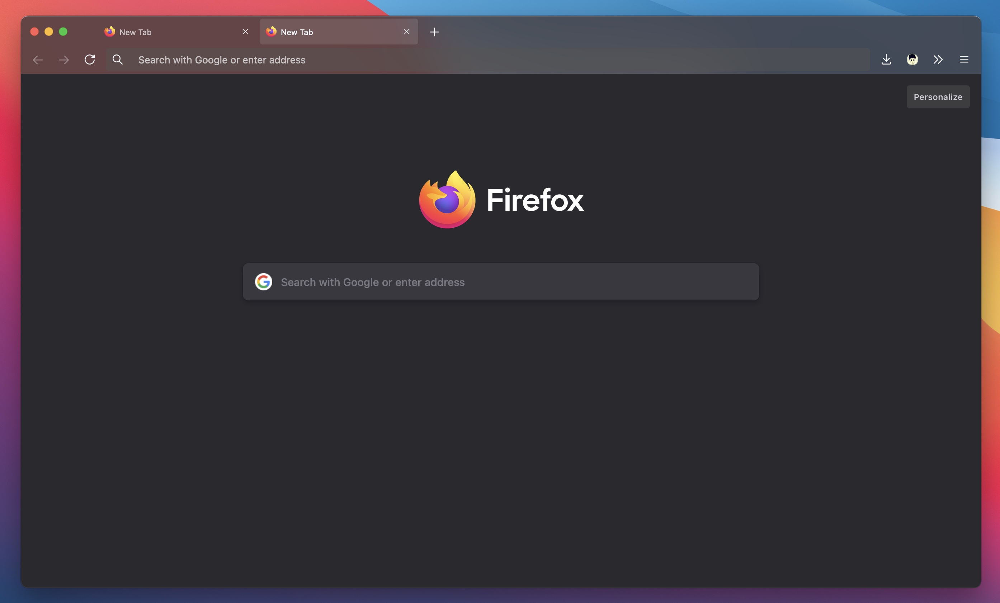
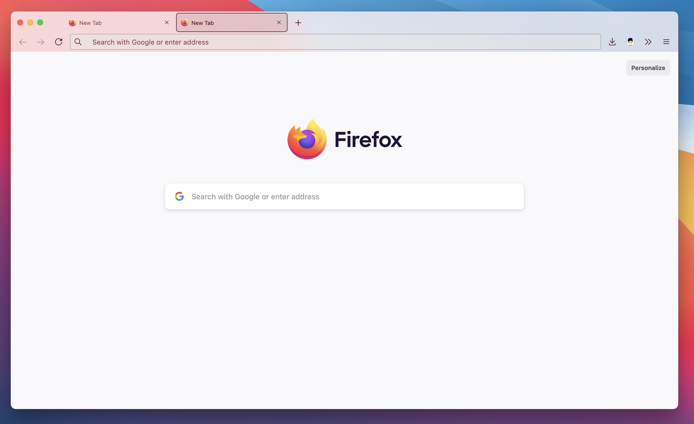

# TranslucentFox

Firefox's semi-transparent UI on macOS works perfectly in both light and dark modes.

## Preview

Light theme

Dark theme

Work with Firefox Color extension

## Installation

1. open your profile folder by type `about:support` in the address bar, find the "Profile Folder" and open it.
2. Download the source code, copy the `user.js` file and `chrome` folder into your Firefox profile directory.
3. Restart the browser.

## Please note

- Only tested on mac, doesn't sure what will happen on Windows.